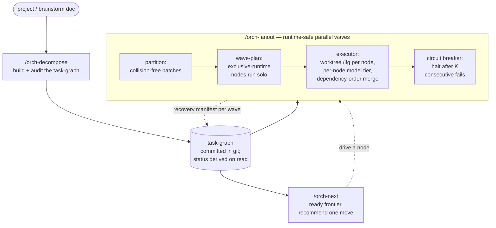

# Compound Engineering Orchestrator

Project **decomposition and orchestration** layered on top of the
[compound-engineering](https://github.com/EveryInc/compound-engineering-plugin) plugin.

Compound Engineering ships excellent per-feature primitives — `ce-plan` decomposes one
feature into units, `ce-work` fans out worktree-isolated sub-agents, `lfg` runs the full
single-unit pipeline. What it doesn't do is operate one level *above* a single feature:
nothing decomposes a whole multi-feature project, maps dependencies across tickets, or
tracks where the project stands outside one chat session.

This plugin fills that layer. It is a **hard dependency** on compound-engineering: its
skills compose CE skills (`ce-plan`, `ce-brainstorm`, `ce-work`, `lfg`) rather than
reimplement them.

## The pipeline

The three skills operate over one durable artifact — a committed, diffable **task-graph**
under `docs/plans/<project-slug>/`. Structure lives in git; live status is *derived* from
git on read, so any session or machine resumes by reading the files.



In words: **`/orch-decompose`** builds the committed task-graph → **`/orch-next`** recommends the
single highest-leverage next move → **`/orch-fanout`** runs it in parallel waves
(partition → wave-plan → executor → circuit breaker), checkpointing recovery state each wave.
Every skill reads and writes the one task-graph; nothing holds project state in a chat session.

## Skills

All three are **manual-invoke** (`disable-model-invocation: true`).

### `/orch-decompose`

Turns a big project (or a brainstorm/strategy doc) into the committed task-graph: a markdown
`index.md` plus one file per node. Each node is a feature-sized unit tagged with the CE stage
it next enters (`brainstorm` / `plan` / `work`), a model tier, and `exclusive_runtime`,
embedding a `ce-plan`-shaped plan when settled or a brief otherwise.

- Audits its own output: cycle / orphan / missing-dependency detection, forest-aware
  critical-path and slack, and a granularity guard (`scripts/graph_compute.py`).
- Derives live per-node status from git and `gh` (`scripts/reorient.py`).
- After building the graph, offers to drive the first ready node into `ce-plan`,
  `ce-brainstorm`, or `lfg`.

### `/orch-next`

Reads the task-graph, computes the dependency **ready frontier**, and recommends the single
highest-leverage next move (lowest slack, then most-unblocking) with the exact command to run
it — then fires it. A pure consumer (`scripts/frontier.py`) of the graph + status JSON.

### `/orch-fanout`

Executes ready work in **runtime-safe parallel waves**: partition the ready set into
collision-free batches (`scripts/partition.py`), sequence them into waves where
`exclusive_runtime` nodes run solo (`scripts/wave_plan.py`), show a visible preview, then
drive each wave through `/lfg` in worktree-isolated runs (reusing `ce-work`), merging in
dependency order. Recovery state is checkpointed at every wave boundary
(`scripts/manifest.py`) and reconciled against live git on resume (`scripts/reconcile.py`); a
circuit breaker (`scripts/circuit_breaker.py`) halts the run after K consecutive wave failures.

## Concepts

Shared vocabulary (`CONCEPTS.md`): **task-graph**, **node**, **stage**, **model tier**,
**no_pr node**, **manual status pin**, **ready frontier**, **fan-out batch**,
**exclusive_runtime**, **wave**, **circuit breaker**. Learnings captured along the way live in
`docs/solutions/`.

## Install

This plugin is distributed as a Claude Code marketplace. It requires the
[compound-engineering](https://github.com/EveryInc/compound-engineering-plugin) plugin to be
installed as well.

```bash
# from GitHub
claude plugin marketplace add pjhoberman/compound-engineering-orchestrator
claude plugin install compound-engineering-orchestrator@compound-engineering-orchestrator

# or from a local checkout (for iterating)
claude plugin marketplace add /path/to/compound-engineering-orchestrator
claude plugin install compound-engineering-orchestrator@compound-engineering-orchestrator
```

## Requirements

- [compound-engineering](https://github.com/EveryInc/compound-engineering-plugin) plugin installed.
- Claude Code — the bundled scripts resolve via `CLAUDE_SKILL_DIR`; off-platform invocations
  report unavailability explicitly rather than degrading.
- `python3` (stdlib only) for the bundled scripts.

## Roadmap

The decompose → next → fanout family (plus recovery) is complete. The one deliberately
deferred piece is **`orch-tracker-sync`** — making Linear a live, two-way coordination bus so
the task-graph and an external tracker stay in sync. See `docs/brainstorms/` and `docs/plans/`
for the originating ideation, requirements, and plans.

## Development

```bash
bun install
bun test                 # 86 script tests (TS harness over the Python scripts)
bun run plugin:validate  # claude plugin validate
```

The scripts are stdlib Python; the test harness is a thin Bun/TypeScript layer that shells
out to them. All compute scripts are deterministic, emit JSON, and exit 2 on usage error;
DAG/graph parsing lives in `orch-decompose`'s scripts and the rest are pure consumers of that
JSON (see `docs/solutions/conventions/`).
